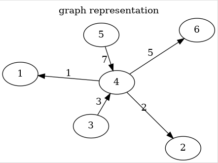
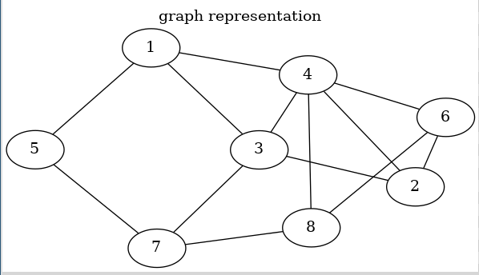
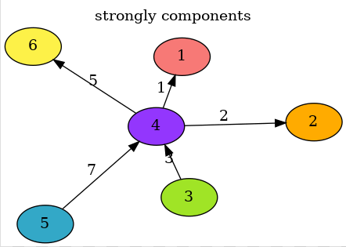
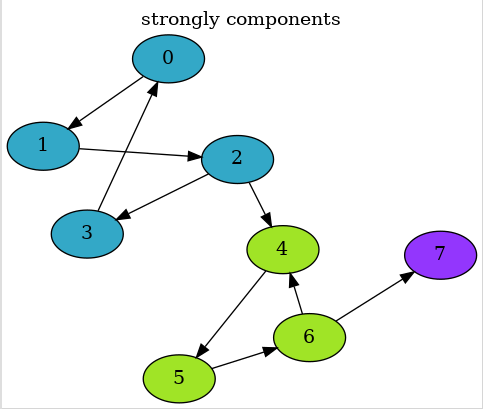

## Graph manipulation with graphviz



## Running project

Install the [Graphviz](https://graphviz.org/) software 

This software is necessary for graphical visualization of the graph or digraph

##### For Debian variants systems

```
sudo apt install graphviz
```

### Build & Usage

```
g++ ./src/main.cpp -o program.o
```
* You can also build the project running the `Makefile` with Make

```
./program.o <text-file>
```

```
./program.o 
```

* The last command above will use the default `input.txt` file as input

## Text file structure with examples

```
V = {1,2,3,4,5,6}; A = {(4,2),(3,4),(4,1),(4,6),(5,4)}; P = {2,3,1,5,7};
```


```
V = {1,2,3,4,5,6,7,8}; A = {(4,2),(2,3),(3,4),(4,1),(3,1),(4,6),(5,7),(6,8),(7,8),(1,5),(2,6),(3,7),(4,8)};
```




```
V = {1,2,3,4,5,6}; A = {(4,2),(3,4),(4,1),(4,6),(5,4)}; P = {2,3,1,5,7};
```




```
V = {0,1,2,3,4,5,6,7}; A = {(0,1),(1,2),(2,3),(3,0),(2,4),(4,5),(5,6),(6,4),(6,7)};
```



